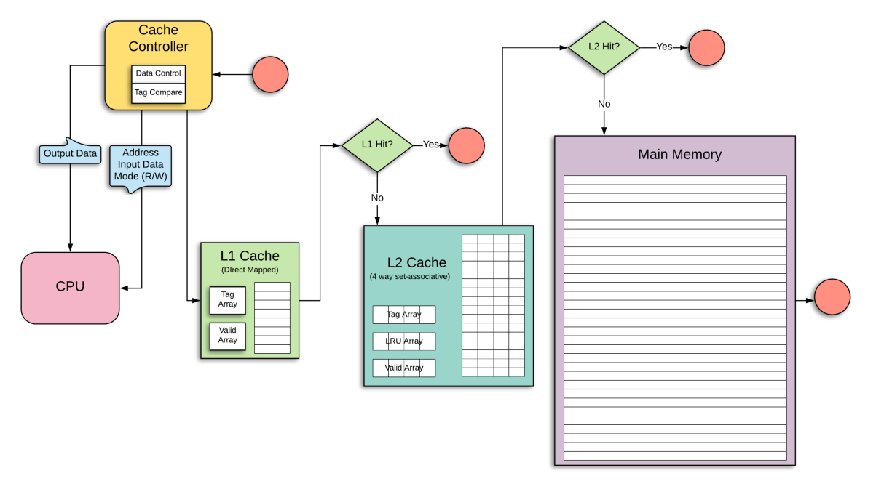
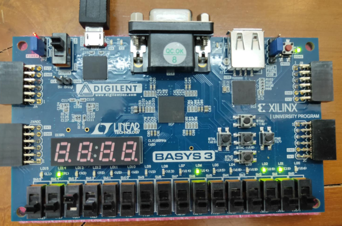
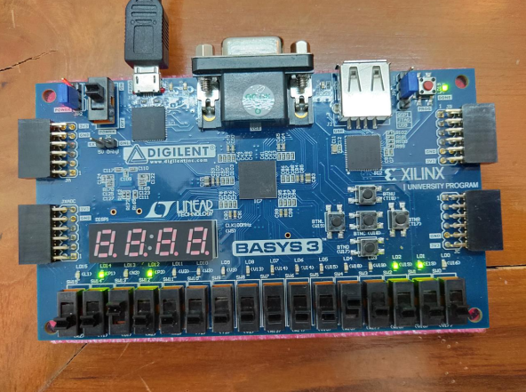
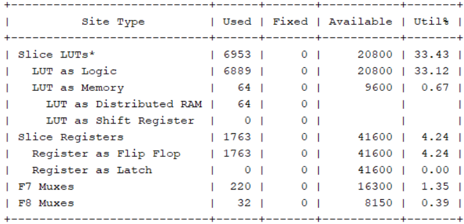
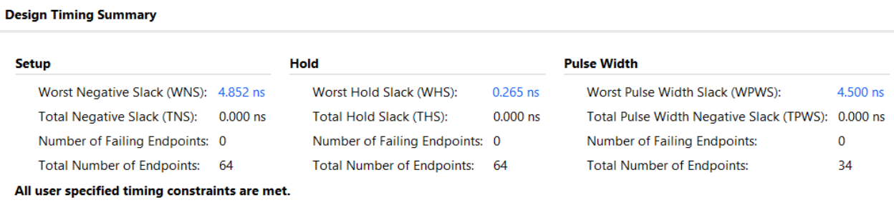
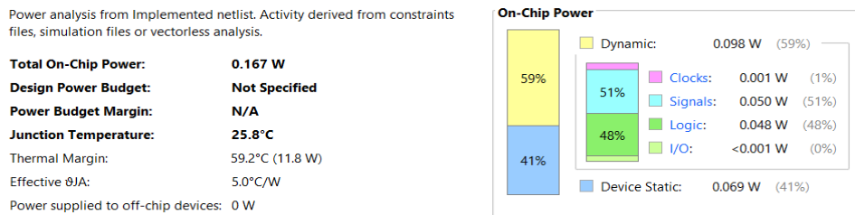

# Multilevel Cache Controller

Implemented a Cache Controller for two layers of Cache Memory. The L1 Cache Memory is Direct Mapped and the mapping used for L2 Cache is four-way set associative.

In direct mapping, each line in the next memory level ( L2 Cache here) is mapped to a specific line in the Cache (L1 Cache here). Direct Mapping being the simplest mapping policy is easiest to implement but has some disadvantages such as if two memory blocks which map to the same line in Cache are continuously referred, then the two blocks are continuously swapped in the Cache Memory.

Set-Associative Mapping is an enhanced form of Direct Mapping where the disadvantages of direct mapping are removed. Instead of mapping a block on a single line in Cache, it is mapped to a set ( a group of lines). In case the set is full, then the least recently used block in Cache is removed to make space for the next block to be stored in Cache.



## File Structure
```shell
.
├── README.md
├── Screenshots
└── src
    ├── constrs
    │   └── Cache_Controller_Constraints.xdc # constraint file
    ├── sim
    │   └── TB_READ.v # simulation test file
    └── sources
        └── CACHE_CONTROLLER.v # main verilog source file
```

## Algorithms and Policies Used:

### Write-Back Policy:

In write-back policy,the data is updated ina cache level everytime a writeinstruction is issuedby the processor, butit is written intohigher levels of cacheor main memory onlywhen the memoryblock evicts from thelower cache level.

- **Pros**
  - Optimizes system speed
- **Cons**
  - Risk of data loss

### No-Write Allocate Policy:

In no-write allocatepolicy, when a writemiss occurs in alower level of cachememory, the data isupdated in the higherlevel of cachememory or in mainmemory (whereverfound), but is notloaded into the lowerlevel cache memory.

- **Pros**
  - Fewer spurious evictions
- **Cons**
  - Slower data read from write location

### Least Recently Used (LRU) Replacement Algorithm

LRU Replacement Algorithm works on the idea that a block of memory that has been heavily used in the last few instructions is likely to be used again in the next few instructions. Thus, the memory block lying unused for the longest time is thrown out whenever required.

- **Pros**
  - Minimizes unnecessary evictions
- **Cons**
  - Time and space consuming

## Implementation on Basys3 FPGA

| Signal      | Value Signal                 |
| ----------- | ---------------------------- |
| Address     | 00000000000 (11 bit) Address |
| Mode        | 0 (Read)                     |
| Output Data | 0110 (4 bit)                 |
| Wait        | 0                            |
| L1 Hit      | 1 (Found in L1 Cache)        |
| L2 Hit      | 0                            |



| Signal      | Value Signal                |
| ----------- | --------------------------- |
| Address     | 00000010000 (11 bit)        |
| Mode        | 0 (Read)                    |
| Output Data | 0110 (4 bit)                |
| Wait        | 1 (Processor in wait state) |
| L1 Hit      | 0 (Not Found in L1 Cache)   |
| L2 Hit      | 0 (Not Found in L2 Cache)   |



## Synthesis Report

### Hardware Usage



- Number of Look Up Tables utilised = 6953
- Percentage of Look Up Tables utilised = 33.43%
- Number of Flip Flops Used = 1763
- Number of F7 Multiplexers used= 220
- Number of F8 Multiplexers used= 32

### Design Time Summary



- Worst Negative Slack = 4.852 ns
- Worst Hold Slack = 0.265 ns
- Worst Pulse Width Slack = 4.500 ns

### On-Chip Power

- Total On-Chip Power = 0.167 W
- Junction Temperature = 25.8 O C
